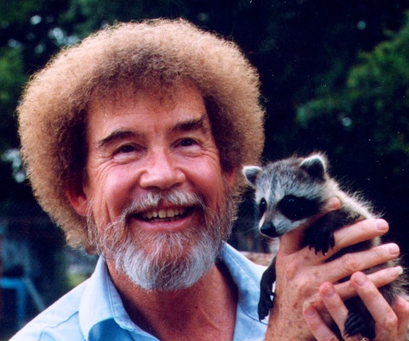

# Summary

The purpose of this workshop was to provide awareness of a powerful modeling technique, that is as easy to implement as a standard GLM. The additional complexity will take some getting used to just like any new tool would, but the payoff is worth it in my opinion. Hope you have some fun adding some wiggle to your model!

